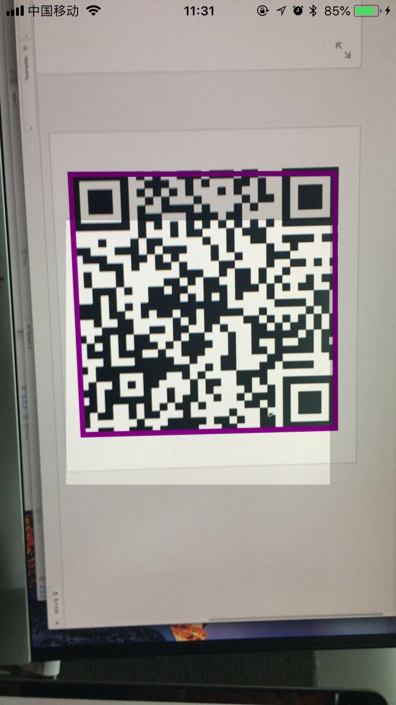
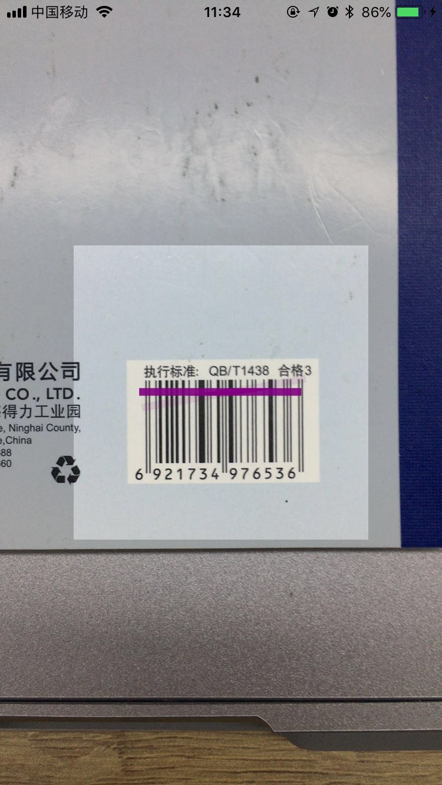

# HRQRCodeScanTool

## Summary 
HRQRCodeScanTool is a lightweight, high cohesion, low couplingpure, pure-Swift tool for QRcode scan.  

## Description
This tool uses AVFoundation based on Swift4.1 API.  It improves the reusability of the code and make the code be easy to maintain and extend in ViewControllers.
This tool support not only qrcode but also support .ean13 .ean8 .upce .code39 .code93 .code128 .code39Mod43.
Don't run in simulator.  


## Example




## Requirements

- Swift 4.1
- iOS 8.0+
- Xcode 9.3

## Installation


***CocoaPods(recommend):***

HRQRCodeScanTool is available through [CocoaPods](http://cocoapods.org).
To install it, simply add the following lines to your Podfile:

```ruby
platform :ios, '8.0'
use_frameworks!

pod 'HRQRCodeScanTool'

```
Then import header in your code
```swift
import HRQRCodeScanTool
```

***Manually***

1. Download and drop ```HRQRCodeScanTool.swift``` in your project.
2. Congratulations!


## Usage example

Remember to add this key-value in your info.plist 
```
<key>NSCameraUsageDescription</key>
<string>CameraUsageDescription</string>
```

Inited from pure code ：

```swift
// in ViewController
HRQRCodeScanTool.shared.delegate  = self
HRQRCodeScanTool.shared.beginScanInView(view: view)
......
// scan result will call in  delegate methods 
func scanQRCodeFaild(error: String){
print(error)
}

func scanQRCodeSuccess(resultStrs: [String]){
print(resultStrs.first)
}
```


### Customization Properties

| property | default value | remark |
|------|----|---|
|open var isDrawQRCodeRect: Bool  |true| 是否描绘二维码边框 默认true |
|open var drawRectColor: UIColor | UIColor.red | 二维码边框颜色 默认红色|
|open var drawRectLineWith: CGFloat |2| 二维码边框线宽 默认2|        
|open var isShowMask: Bool   |true|  是否展示黑色蒙版板层 默认开启|           
|open var maskColor: UIColor   |Black.alpha 0.5|  蒙板层 默认黑色 alpha 0.5|               
|open var centerWidth: CGFloat  |200|  中心非蒙板区域的宽  |        
|open var centerHeight: CGFloat  |5.0|  中心非蒙板区域的宽|        
|open var centerPosition: CGPoint? |nil| 中心非蒙板区域的中心点 默认Veiw的中心

### Public Methods

```swift
open func beginScanInView(view: UIView)
open func setInterestRect(originRect: CGRect)
open func stopScan()
```

## Author

CoderHRXu
Mail: [xuhaoran416518@gmail.com](mailto:xuhaoran416518@gmail.com)
Blog: [www.akpop.top](http://www.akpop.top)
Relevant article： [https://www.jianshu.com/p/e16a4380d7b2](https://www.jianshu.com/p/e16a4380d7b2)
[https://juejin.im/post/5ad9b34851882567361479aa](https://juejin.im/post/5ad9b34851882567361479aa)
[http://www.akpop.top/2018/04/20/Swift4QRCodeTool/](http://www.akpop.top/2018/04/20/Swift4QRCodeTool/)
## License

HRQRCodeScanTool is released under the MIT license. See the LICENSE file for more info.
